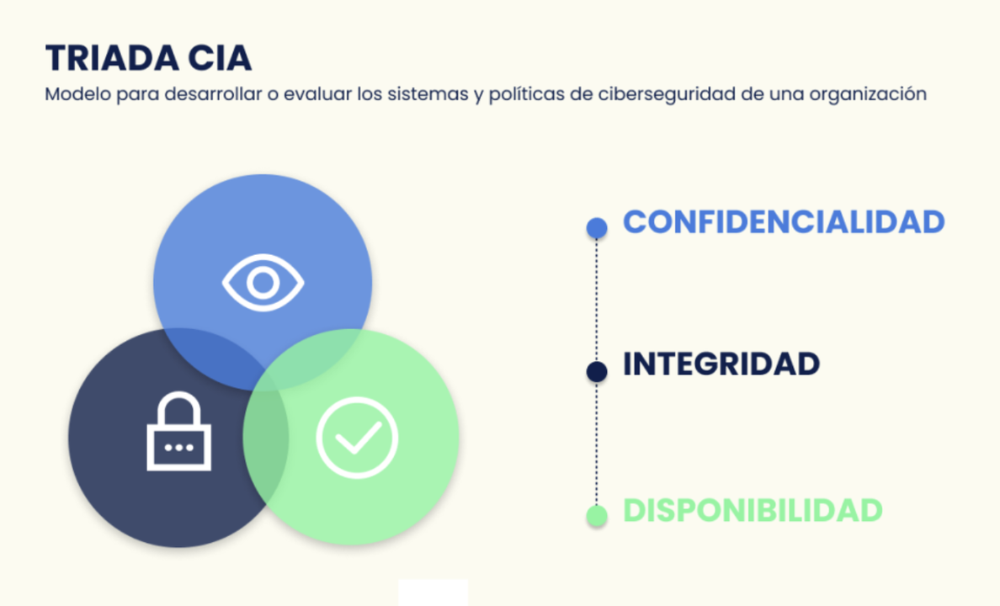

# Introducción a la Ciberseguridad

## Índice
- [La Triada de la Seguridad de la Información](#la-triada-de-la-seguridad-de-la-información)
    - [Confidencialidad](#confidencialidad)
        - [Amenazas](#amenazas)
        - [Medidas de protección](#medidas-de-protección)
    - [Integridad](#integridad)
        - [Amenazas](#amenazas-1)
        - [Medidas de protección](#medidas-de-protección-1)
    - [Disponibilidad](#disponibilidad)
        - [Amenazas](#amenazas-2)
        - [Medidas de protección](#medidas-de-protección-2)
- [Rol del Responsable de Seguridad](#rol-del-responsable-de-seguridad)
    - [Organización](#organización)
    - [Políticas, normas y procedimientos](#políticas-normas-y-procedimientos)
        - [Políticas (Nivel Estratégico)](#políticas-nivel-estratégico)
        - [Normas y Estándares (Nivel Táctico)](#normas-y-estándares-nivel-táctico)
        - [Procedimientos (Nivel Operativo)](#procedimientos-nivel-operativo)
    - [Controles](#controles)
        - [Controles Físicos](#controles-físicos)
        - [Controles Técnicos](#controles-técnicos)
        - [Controles Administrativos](#controles-administrativos)
    - [Clasificación y controles de activos](#clasificación-y-controles-de-activos)
    - [Áreas en la Seguridad de la Información](#áreas-en-la-seguridad-de-la-información)

### La Triada de la Seguridad de la Información

Hay que hacer un énfasis en las diferencias entre las definiciones de terminos que parecen iguales pero no lo son

> **Ciberseguridad**: Se encarga de defender los sistemas de información, equipos, redes, de amenazas.
>
> **Seguridad Informática**: Conjunto de medidas **PREVENTIVAS, DE DETECCIÓN Y DE CORRECIÓN** destinadas a proteger la triada *(Parece como si quisieramos defender la trifuerza)*.

#### Confidencialidad

- La información debe ser accedida por sujetos autorizados
- **Identificación**, **Autentificación** y **Autorización** son sus bases.

##### Amenazas 

- Ingeniería Social.
- OSINT.
- Usuarios descuidados.
    - “Una cadena es tan fuerte como el más débil de sus eslabones.”
    - “El hilo se corta por la parte más delgada.”
- Atacantes.
- Robo y divulgación de información.
- Descargas peligrosas involuntarias (Drive-by download).
- Trashing.

##### Medidas de protección

- Clasificación de la información.
- Mecanismos de control de acceso informático.
- Cifrado de datos.
- Capacitación del personal:
    - Identificación de Phishing.
    - Divulgación de información.
    - Procedimientos de acceso a la información.

#### Integridad

- La información debe ser modificada únicamente por los sujetos autorizados
- La información enviada por el emisor deber ser idéntica a la información recibida por el receptor.

##### Amenazas 

- Ingeniería Social.
- Actividad de usuarios no autorizados.
- Malware:
    - Virus: Alteran el comportamiento de los programas.
    - RATs: Controlan máquinas.
    - Falsas Alertas.
    - Sitios Peligrosos.

##### Medidas de protección

- Menor Privilegio.
- Segregación de Funciones.
- Procedimientos de control de cambios.
- Verificación de Integridad.
- Antivirus.
- Firewall.

#### Disponibilidad

- Es la característica que intenta asegurar que la información se encuentre accesible en tiempo y forma según se requiera.

##### Amenazas 

- Denegación de Servicios.
- Desastres Naturales.
- Acciones humanas – Intencionales o accidentales.
- Malware:
    - Worms (Gusanos): Se replican por la red.
    - Crypto-Ransomware: Cifra archivos.

##### Medidas de protección

- Seguridad Física.
- Mecanismos de tolerancia a fallos.
- Plan de contingencia.
- Aplicar mecanismos de defensa (firewall, segmentación de red).
- Procedimientos operativos estándar (SOP)

### Rol del Responsable de Seguridad

Está el CISO (*Chief Information Security Officer*) que es la cabeza principal. Como funciones principales tiene

- Cumplir con el programa integral de Seguridad para garantizar la confidencialidad, integridad y disponibilidad
- Gestionar los recursos necesarios para cumplir el programa integral de seguridad.
- Determinar prioridades.
- Comunicarse con la alta dirección.

#### Organización

La seguridad de la información debe ser incumbencia de la alta gerencia de la organización. NO debe circunscribirse al área de Sistemas. 

#### Políticas, normas y procedimientos

##### Políticas (Nivel Estratégico)

Estas mismas deben ser:

- Realizadas y aprobadas por el comité de seguridad de la información.
    - Alineadas con la estrategia de negocio.
- Comunicadas a todos los integrantes de la organización.
- Escritas en un lenguaje claro, independiente de la tecnología y sin ambigüedades.
- Definidos los roles y responsabilidades para la implementación.
- Contenido:
    - Objetivos.
    - Alcance.
    - Importancia de la seguridad de la Información.
    - Propósito de los responsables a nivel gerencial demostrando el apoyo.
    - Explicación de las políticas, principios, normas y requisitos de cumplimiento en materia de seguridad.
    - Definición de responsabilidades para la gestión de la Seguridad de la Información

##### Normas y Estándares (Nivel Táctico)

Es un conjunto de reglas aplicadas a todas las actividades relacionadas al manejo de la información de una entidad, teniendo el propósito de proteger la información, los recursos y la reputación de la misma

##### Procedimmientos (Nivel Operativo)

Es un conjunto de pasos para cumplir las políticas y normas definidas por la organización.

#### Controles 

El principal objetivo del establecimiento de controles de seguridad de la información es reducir los efectos producidos por las amenazas y vulnerabilidades a nivel tolerable por la empresa.

#### Controles Físicos

- Guardias de Seguridad.
- Cerraduras.
- Protección del edificio.
- Cámaras de seguridad.
- Controles ambientales.

#### Controles Técnicos

- Control de acceso lógico.
- Encriptación o Cifrado.
- Identificación.
- Autenticación.
- Monitoreo lógico.

#### Controles Administrativos

- Políticas.
- Estándares.
- Procedimientos.
- Concientización.
- Control de Cambios.
- Autorización.

#### Clasificación y controles de activos

- Clasificación:
    - Activos de información: Archivos, bases de datos, manuales, etc.
    - Activos de software: Aplicaciones, programas de desarrollo.
    - Activos físicos: Máquinas, servidores.
    - Servicios: Comunicaciones.
    - Personas.
    - Activos intangibles: Reputación, imagen de la organización.
- Busca mantener una adecuada protección de los activos.
- Se designa un propietario para cada uno de los activos.
- Se debe realizar un inventario de activos.

#### Áreas en la Seguridad de la Información

- Análisis Forense y Auditoría.
- Análisis de Malware y Threat Intel.
- Criptografía.
- Seguridad en el Desarrollo de Aplicaciones.
- Desarrollo del Programa de Seguridad.
- Gestión de Riesgo.
- Gestión del Programa de Seguridad de la Información.
- Gobierno de Seguridad de la Información.
- Marco Legal.
- Modelos y Arquitecturas de Seguridad.
- Continuidad del negocio y Plan de recupero de desastre.
- Seguridad en las Operaciones.
- Seguridad en Redes, Internet y Telecomunicaciones.
- Seguridad Física.
- Sistemas y Metodologías de Control de Acceso.
