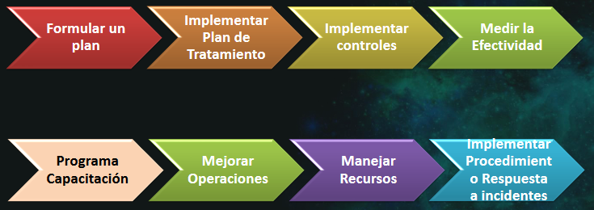

# Gestión de la Seguridad de la Información

## índice

- [Gestión de la Seguridad de la Información](#gestión-de-la-seguridad-de-la-información)
  - [índice](#índice)
    - [Introducción a los Sistemas de Gestión de la Seguridad de la información (SGSI)](#introducción-a-los-sistemas-de-gestión-de-la-seguridad-de-la-información-sgsi)
    - [Normas para la Gestión de la Seguridad de la Información](#normas-para-la-gestión-de-la-seguridad-de-la-información)
    - [ISO 27001:2022](#iso-270012022)
      - [Atributos de los controles de la ISO 27001:2022](#atributos-de-los-controles-de-la-iso-270012022)
    - [Implementación de una SGSI](#implementación-de-una-sgsi)
      - [Proceso](#proceso)
      - [Establecer el SGSI](#establecer-el-sgsi)
      - [Implementar y Operar una SGSI](#implementar-y-operar-una-sgsi)
      - [Monitorear y revisar el SGSI mientras se implementa](#monitorear-y-revisar-el-sgsi-mientras-se-implementa)
      - [Mantener y mejorar el SGSI](#mantener-y-mejorar-el-sgsi)
      - [Documentación del SGSI](#documentación-del-sgsi)
      - [Auditorías internas SGSI](#auditorías-internas-sgsi)
      - [Mejoramiento continuo](#mejoramiento-continuo)

### Introducción a los Sistemas de Gestión de la Seguridad de la información (SGSI)

La Gestión de la Seguridad de la información implica establecer mecanismos de seguridad que permitan **MONITOREAR, SUPERVISAR, DIRIGIR, OPTIMIZAR RECURSOS, TOMAR LAS MEJORES DECISIONES Y MANTENER LA PROTECCIÓN DE LOS ACTIVOS, A SU VEZ APOYANDO LOS OBJETIVOS DE LA ORGANIZACIÓN**. No podemos ir en contra del rumbo de la organización, las políticas, normas y procesos que se definan entre el CISO y la alta gerencia tienen que estar alineados al negocio.

El objetivo de este tema es gestionar en forma efectiva la Seguridad de la Información dentro de una organización, enfocarse en las tareas y el conocimiento con los que debe contar el gerente de seguridad de la información.

### Normas para la Gestión de la Seguridad de la Información

- Serie ISO 27000 (ex IRAM/ISO/IEC 17799, basada en BS 7799):
  - Establece una base común de buenas prácticas para desarrollar normas de seguridad.
- 27.000: Información genérica para un SGSI y definiciones.
- 27.001: Requisitos de los SGSI → Certificable.
- 27.002: Objetivos de control, controles recomendables y guía de implementación.
- 27.005: Gestión de riesgos

Otros SGSI:

- ISO 22301 (Continuidad de negocio), COBIT 2019 (Control Objectives for Information and related Technology), MITRE, NIST 800-53, ITIL (Information Technology Infrastructure Library), COSO (Committee of Sponsoring Organizations), PCI, ISAE 3402 (SOC), etc.

### ISO 27001:2022

93 controles, 4 dominios.

- 37 Organizaciones (Políticas, roles, responsabilidades sobre el manejo de la información)
- 8 Personas
- 14 Físicos (Cuidar el perímetro, organizar las oficinas, monitorear amenazas físicas o ambientales, etc)
- 34 Tecnológicos (Acceso a un código fuente, accesos privilegiados, proteger contra malware, criptografia, etc)

**Nuevos controles:**

- Threat Intelligence. (org)
- Seguridad de la información para el uso de servicios Cloud. (org)
- Prepraración ICT (Information and Communication Technology) para continuidad de negocio. (org)
- Monitoreo de seguridad física. (fis)
- Gestión de configuración. (tec)
- Borrado de información. (tec)
- Enmascarado de datos. (tec)
- Prevención de fuga de información. (tec)
- Monitoreo de actividades. (tec)
- Filtrado web. (tec)
- Desarrollo seguro. (tec)

#### Atributos de los controles de la ISO 27001:2022

**Cada control tiene:**

- Tipo: Preventivo, Detectivo, Correctivo.
- Propiedades: Integridad, Confidencialidad, Disponibilidad.
- Conceptos: Identificar, Proteger, Detectar, Responder, Recuperar.
- Capacidades: Gobierno, Gestión de activos, Protección de Información, Seguridad de RRHH, Seguridad física, Seguridad de sistemas y redes, Seguridad de aplicaciones, Configuración segura, Gestión de Identidades y accesos, Gestión de amenazas y vulnerabilidades, Continuidad, Seguridad en las relaciones con proveedores, Cumplimiento y legales, Gestión de eventos de seguridad de la información, Garantía de seguridad en la información.
- Dominios: Gobierno y ecosistema, Protección, Defensa, Resiliencia.

***Resumen de cada control con sus correspondientes TIPOS, PROPIEDADES, CONCEPTOS, CAPACIDADES Y DOMINIOS*** [aquí](https://drive.google.com/file/d/1eAFZdhPUMrn579ZsxEM0ynxd5BQ53yfm/view)

> En caso de que la ISO sea insuficiente con los controles que abarca, se pueden realizar controles complementarios por fuera de la ISO. Mismo caso si hay ámbitos que la ISO abarca pero en la organización no ocupan, por lo que ese control no se realiza.

### Implementación de una SGSI

#### Proceso

La adopción del SGSI debe ser una decisión estratégica dentro de la organización y debe tener apoyo de la alta gerencia. Esto involucra a cada parte de la organización, no puede haber persona que no sepa sobre el tema y haga lo que quiera, sino que tiene que acatar a las normas.

Enfatizar la importancia en:

- Entender los requerimientos de Seguridad de la Información.
- Establecer políticas y objetivos de Seguridad de la Información.
- Implementar y operar controles.
- Manejar los riesgos de la Seguridad de la Información.
- Monitorear y revisas el desempeño.
- Mejoramiento continuo en base a la medición del objetivo.

#### Establecer el SGSI

- Definir alcance/límites del SGSI en términos de las características del negocio.
- Definir la política:

#### Implementar y Operar una SGSI

#### Monitorear y revisar el SGSI mientras se implementa

- Realizar revisiones teniendo en cuenta la auditoría, incidentes y mediciones de seguridad.
- Realizar evaluaciones de riesgos a intervalos planeados tomando en cuenta los cambios.
- Realizar revisiones gerenciales periódicas del SGSI.
- Actualizar los planes de Seguridad.
- Registrar eventos y acciones que podrían tener impacto en el desempeño del SGI.

#### Mantener y mejorar el SGSI

#### Documentación del SGSI

- Política y objetivos del SGSI.
- Alcance del SGSI.
- Tiene que estar actualizado
- Procedimientos y controles de soporte de SGSI.
- Descripción de la metodología de evaluación de riesgos.
- Informe de evaluación de riesgos.
- Plan de tratamiento del riesgo.
- Procedimientos documentados de planeación, operación y control.
- Enunciado de aplicabilidad.

#### Auditorías internas SGSI

- La organización debe realizar auditorías internas a intervalos planeados para determinar si los objetivos, controles, procesos y procedimientos:
- Cumplen los requerimientos del estándar.
- Cumplen con los requerimientos de Seguridad.
- Se implementan y mantienen de manera efectiva.
- Se realizan conforme a lo esperado.

#### Mejoramiento continuo

- La organización debe realizar acciones:
  - Correctiva: Para eliminar la causa de las no conformidades con los requerimientos de SGSI para evitar la recurrencia.
  - Preventiva: Para eliminar la causa de las potenciales no conformidades de los requerimientos
  - SGSI para evitar la ocurrencia.

