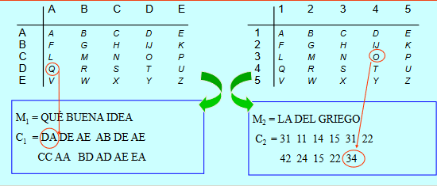
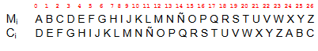
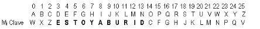
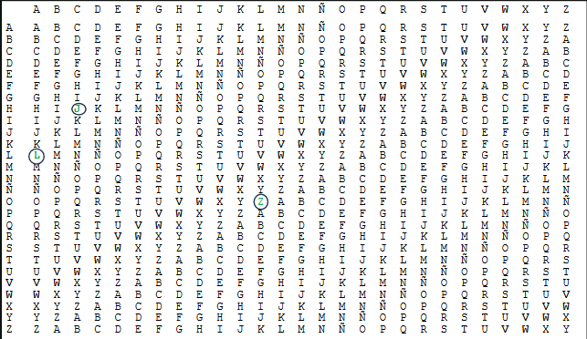
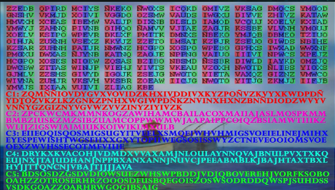

# Criptografía

## índice

### Criptología

Viene del griego *kripto* (oculto) y *logos* (estudio). Es una disciplina o ciencia que estudia la manera de cifrar y descifrar los mensajes con una o más llaves para que resulte imposible conocer su contenido a los que no dispongan de las claves utilizadas.

Se divide en:
- **Criptología *(Escritura oculta)***: Arte de escribbir en forma secreta o de modo enigmático
- **Criptoanálisis *(Análisis de lo oculto)***: Arte de descrifrar criptogramas.
- **Esteganografía *(escritura cubiera, oculta o protegida)***: Arte de ocultar mensajes u objetos, dentro de otros.
- **Estegoanálisis *(Análisis de lo cubierto)***: Estudio de la detección de mensajes ocultos usando Esteganografía.

### Elementos

Un sistema criptográfico está conformado por estos elementos:

- **Cifrado**: Es el algoritmo utilizado, instrucciones que se van a utilizar para cifrar o descrifrar un texto plano.
- **Texto plano/ Claro**: Es el documento original que queremos cifrar, el mensaje legible que queremos trasmitir, haciendo que deje de ser legible para así trasmitirlo y que las personas que queremos que lo lean, lo puedan hacer.
- **Criptograma**: Documento/ Texto cifrado. Es el resultado de aplicar a un texto plano el algoritmo
- **Claves**: Llaves (Criptovariables) que permiten cifrar/descrifrar un criptograma.
- **Espacio de llaves**: Conjunto de todas las llaves posibles del Criptosistema.
- **Alfabeto**: Conjunto de todos los caracteres posibles que se encuentran en el criptosistema. Puede haber uno o más alfabetos, dependiendo del algoritmo que se aplique.
- **Criptosistema**: Es el conjunto completo de elementos que conforman un sistema criptográfico.

### Propósito

¿Para qué usamos la criptografía? La usamos para proteger y transmitir la información mediante un medio inseguro de forma tal que solo quien está autorizado pueda leerla y comprenderla. 

En la antigüedad se pretendía garantizar la **confidencialidad**, la **integridad** y la **autenticidad**. A finales del siglo XX se han añadido la **disponibilidad** y, últimamente el **no repudio**.

### Clasificación de la Criptografía

Después de la revolución en la criptografía que supuso el código enigma y la Segunda Guerra Mundial, hubo un cambio de paradigma que separó dos épocas, una con la *Criptografía Clásica*, y la otra con la *Criptografía Moderna*.

- Criptografía Clásica: La seguridad se basaba en el **Secreto del álgoritmo**. Estos se podían cifrar por transposición y por sustitución.
- Criptografía Moderna: La seguridad se basa en el **Secreto de la llave**.

#### Criptografía Clásica - Transposición

Se lo conoce también como permutación, en el cual los caracteres se cambian de posición según ciertas reglas. El criptográma tendrá los mismos caracteres del mensaje pero en un orden distinto.

Su Criptoanálisis se realiza aplicando técnica de Anagramación.

Ejemplos:
- Escritura inversa (Hola = aloh).
- Transposición de Columna/Fila.
- Rejilla.
- Grupos.
- Escítala

#### Criptografía Clásica - Sustitución

Se lo conoce también como confusión, en el cual el criptograma tendrá caracteres distintos a los que tenía el mensaje, sustituyendo caracteres del mismo u otros alfabetos.

Su Criptoanálisis se basa en utilizar las letras más frecuentes del idioma del mensaje, asignándolas a las más frecuentes del mensaje encriptado y así ir rompiendoló.

##### Subtipos de la Sustitución

- Sustitución Simple: un caracter del mensaje se remplaza por un caracter del alfabeto del criptograma (alfabeto de sustitución).
    - Monoalfabéticos: Un caracter del mensaje se remplaza por un caracter del alfabeto de sustitución.
        - Ejemplos: Atbash, Cesar, ROT13, afín, francmasón.
    - Polialfabéticos: Un caracter no siempre se sustituye por el mismo caracter. Se utilizan varios alfabetos.
        - Ejemplos: Alberti, Vigenère, Vernam.
    - Homófonos: Los caracteres más comunes del mensaje se pueden representar con más de un caracter del alfabeto de sustitución.
        - Ejemplo: Código navajo.
- Poligráfico o por bloques: Se sustituyen grupos de caracteres del mensaje por otros.
    - Ejemplos: Playfair, Hill

#### Criptografía Clásica - Ejemplos

##### Escitala (400 A.C.)

Fue el primer cifrador por transposición, el cual consistía en un Bastón en el que se enrollaba una cinta de cuero y luego se escribía en ella el mensaje de forma longitudinal. Al desenrollar la cinta, las letras aparecerán desordenadas.

Para descifrar el criptograma y recuperar el mensaje en claro hay que enrollar la cinta en un bastón con el mismo diámetro.

##### Polybios (Siglo II A.C.)

- Cifrador por sustitución.
- Duplica el tamaño del texto plano, por lo que no es tan eficiente.

##### César (Siglo I A.C.)

*Siempre en nuestros corazones Caesar Anthonio Zeppeli.*

Dejando de lado las bromas, este algoritmo fue utilizado por Julio César. Consistía en el desplazamiento de tres espacios hacia la derecha de los caracteres del texto plano. Es un cifrador por sustitución monoalfabético en el que las operaciones se realizan **módulo n**, siendo n el número de elementos del alfabeto (en ese entonces el latín). Cada rotamiento se lo conoce como rot n, siendo el más popular el rot 13.

Para aumentar la seguridad podemos incluir en el alfabeto de cifrado una clave:
- La clave K es una palabra o frase que se escribe a partir de una posición p₀ del alfabeto en plano.
- Los caracteres repetidos de la clave no se escriben.
- Una vez escrita en la posición indicada se añaden las demás letras en orden.

##### Alberti (1467)

Alberti es polialfabético por sustitución y describe un disco cifrador con el que es posible cifrar textos sin que exista una correspondencia única entre el alfabeto del mensaje y el de cifrado.

Con este sistema, cada letra del texto en claro podía ser cifrada con un caracter distinto
dependiendo esto de una clave secreta.

##### Vigenère (1586)

Es un cifrador polialfabético por sustitución que soluciona la debilidad del cifrado del César, en el cual una letra se cifra siempre igual. Se usa una clave K de longitud L que debe ser de la misma longitud que el texto a cifrar, y se cifra caracter a caracter sumando **módulo n** al texto en claro con los elementos de esta clave: Cᵢ = Mᵢ + Kᵢ (mod 27)

Para codificar y decodificar se utiliza la tabla Vigenère:

**Criptoanálisis de Vigenère**

***Método de Kasiski (1863)***

Consiste en buscar repeticiones de “cadenas de caracteres” en el criptograma. Si estas cadenas son mayores o iguales a tres caracteres y se repiten más de una vez, es probable que se deba a cadenas de texto plano que se han cifrado con una misma porción de la clave. Si se detectan estas cadenas, la distancia entre las mismas será múltiplo de la longitud de la clave. Luego, el máximo común divisor entre esas cadenas es un candidato a ser la longitud de la clave

Una vez obtenido la longitud de la clave, se pasa al índice de coincidencia (IC) (1920)

##### Enigma (1923)

Eran máquinas con rotores que permiten cifrado polialfabético, inventadas por el ingeniero alemán Arthur Scherbius. Son las míticas máquinas utilizadas por el ejército alemán en la WWII para cifrar los mensajes de los altos mandos del ejército a la hora de la comunicación formal o estratégica en la batalla. Su popularidad también se debe al matemático británico Alan Turing, quien fue la cabeza de la creación de *Bombe*, la máquina que se utilizó para descifrar a Enigma.

Consiste en un banco de rotores montados sobre un eje, en cuyos perímetros había 26 contactos eléctricos, uno por cada letra del alfabeto inglés. Su cifrado fue roto durante la segunda guerra.

En 1929, personas de origen polaco interceptaron una máquina Enigma enviada de Berlín a Varsovia y equivocadamente no protegida como equipaje diplomático.
- Un joven matemático polaco, Marian Rejewski, notó un patrón con el que podía suponer el cableado de un rotor, no por las letras, sino por la manera que éstas cambiaban.
- A mediados de 1939 los polacos compartieron su trabajo con franceses y británicos debido a la posible invasión de su país.
- Creditos a: Marian Rejewski, Jerzy Rozycki y Henryk Zygalski.

