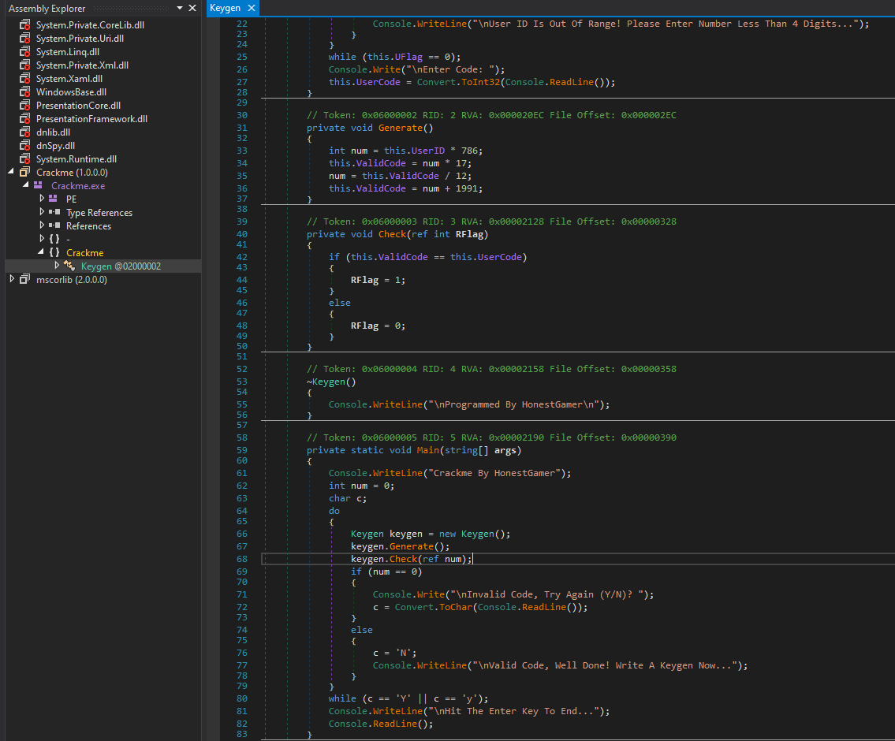

# Laboratorio 1 - Ciberseguridad

Trabajo realizado en la primera vivencia de laboratorio de la cursada de Ciberseguridad, UTN FRBA 1er Cuatrimestre 2024.

**Curso**: K3011

**Profesores**: Gabriela Verónica Nicolao - Paula Alicia Suarez - Matias Mikael Baghdassarian

**Alumno**: Kevin Harold Quiñones Garnica

**Legajo**: 173.110-5

Este documento tiene como finalidad explicar, detallar y mostrar los conocimientos adquiridos a lo largo del laboratorio a través de un *walk through* de los tres ejercicios realizados, y como detalle final, resolver dos ejercicios del sitio web [*ringzer0*](https://ringzer0ctf.com/), adjuntando la resolución junto con sus debidas *flags*.

**Programas utilizados**

- PEstudio
- dnSPY
- HxD
- Ida free

## Índice

- [Laboratorio 1 - Ciberseguridad](#laboratorio-1---ciberseguridad)
  - [Índice](#índice)
    - [Primera parte](#primera-parte)
      - [Crackme.exe](#crackmeexe)
        - [Consigna](#consigna)
        - [Resolución](#resolución)
        - [Keygen](#keygen)
      - [RemoveCheck.exe](#removecheckexe)
        - [Consigna](#consigna-1)
        - [Resolución](#resolución-1)
      - [Encuentre la contraseña.exe](#encuentre-la-contraseñaexe)
        - [Consigna](#consigna-2)
        - [Resolución](#resolución-2)
    - [Segunda parte](#segunda-parte)
      - [Ejercicio 18](#ejercicio-18)
      - [Ejercicio 71](#ejercicio-71)

### Primera parte

#### Crackme.exe

##### Consigna

- Este es un programa codificado en C# (.NET) usando Visual Studio 2010.
- El ID de usuario debe ser un integer menor a 4 digitos.
- El código de usuario también debe ser un integer.

1. Estudie la lógica del programa para encontrar la solución.
2. Programe un [keygen](#keygen).

##### Resolución

Nos dieron un archivo ejecutable que debemos analizar para cumplir con las consignas, obedeciendo las condiciones a cumplir. Como primer medida de seguridad, más que nada para adoptar buenas prácticas, abrimos una maquina virtual corriendo Windows 10 como SO donde tenemos los programas a utilizar.

Como primer paso, que se repetirá a lo largo del laboratorio, abrimos el ejecutable dentro del PEstudio, que es una herramienta de análisis estático que nos permite obtener las principales características del ejecutable a analizar sin la necesidad de que ejecute. Como datos importantes a ver en el PEstudio son los *first bytes*, el *tamaño*, la *entropía*, metadata, los hashes *md5* y *sha256*, el *compiler stamp*, *signature*, para que tipo de cpu está diseñado (32-bit o 64-bit), *strings*, etc.

**Datos relevantes**

|Descriptor|Data|
|-|-|
|first-bytes-hex|4D 5A 90 00 03 00 00 00 04 00 00 00 FF FF 00 00 B8 00 00 00 00 00 00 00 40 00 00 00 00 00 00 00 00|
|first-bytes-text| M Z .. .. .. .. .. .. .. .. .. .. .. .. .. .. .. .. .. .. .. .. .. .. @ .. .. .. .. .. .. .. .. |
|size|5632 bytes|
|entropy| 4.185|
|signature| Microsoft .NET|
|cpu| 32-bit|
|compiler-stamp| Tue Feb 15 17:56:03 2011 UTC|
|virustotal-score|(2/71)|

Muchos de estos datos, por más que en general te indiquen una situación, dependerá de nuestro analisis el tomar la decisión de si hacer caso a los casos generales. Como ejemplo tenemos el dato de *virustotal-score* que nos dice que dos analizadores lo catalogaron como malware dentro de 71 posibles, pero al ser un número bajo, podemos inferir que estamos ante un caso de *falso-positivo*, teniendo en consideración la fecha de compilación (que no necesariamente es la correcta), cuales fueron los analizadores que lo catalogaron como malware, si son de renombre o son genéricas, etc.

Una vez realizado una visualización genérica del programa, revisaremos los strings del mismo para tratar de ver si el archivo está *ofuscado*, ya que si tenemos pocos strings en un programa con un peso relativamente alto, nos puede dar esa señal de alarma. Además, como un string es una secuencia de caracteres seguidos del carácter nulo, PEstudio nos puede mostrar strings que sean imprimibles y tenga sentido, o una secuencia de caracteres sin sentido, que si son los que predominan, podriamos estar frente a un programa ofuscado.

Si juntamos la información que nos brindan los strings junto con la entropía del programa, en caso de que esta última sea alta (6 < entropía < 8), podemos inferir que esté ofuscado o parcialmente ofuscado.

¿Porque es importante ver los strings?

Porque nos muestra un pantallazo de lo que realiza el programa, ya que si hay urls, IP, dominio, etc a las que quiere acceder, lo va a mostrar. Las cadenas son importantes porque nos muestran comportamiento y datos relevantes que nos servirán para analizar y ver si hay comportamiento extraño.

Una vez hecho todo esto, abrimos el programa con el *dnSPY* ya que, al ser un programa progrado en .NET, podemos decompilarlo y ver a simple vista como está desarrollado.

Ahora podemos ver el comportamiento. Como primera acción, genera un `Keygen` cuya lógica es:

    private Keygen()
    {
        do
        {
            Console.Write("\nEnter User ID: ");
            this.UserID = Convert.ToInt32(Console.ReadLine());
            if (this.UserID > 0 && this.UserID < 10000)
            {
                this.UFlag = 1;
            }
            else
            {
                this.UFlag = 0;
                Console.WriteLine("\nUser ID Is Out Of Range! Please Enter Number Less Than 4 Digits...");
            }
        }
        while (this.UFlag == 0);
        Console.Write("\nEnter Code: ");
        this.UserCode = Convert.ToInt32(Console.ReadLine());
    }

Pide por consola que escriban un `User ID`, cuyo valor no puede sobrepasar los 4 dígitos. En caso de que suceda, se pide que reingrese un valor correcto. Este se guarda en la variable `this.UserID`.

Después, pasamos a la función `Generate()` que se encarga de generar el código correcto. 

    private void Generate()
    {
        int num = this.UserID * 786;
        this.ValidCode = num * 17;
        num = this.ValidCode / 12;
        this.ValidCode = num + 1991;
    }

Como vemos, al `User ID` que ingresamos por consola, lo multiplica por 786 y por 17, para después dividirlo por 12 y al final sumarle 1991. Al valor obtenido lo almacena en `this.ValidCode`.

Ya teniendo `this.UserID` y `this.ValidCode`, se utiliza la función `Check()` que los comparará. Si son iguales, setteara su `RFlag` en 1. Caso contrario, lo setteara en 0.

Una vez conocidos estos valores, pasamos a ver el comportamiento de la función `main`

    private static void Main(string[] args)
    {
        Console.WriteLine("Crackme By HonestGamer");
        int num = 0;
        char c;
        do
        {
            Keygen keygen = new Keygen();
            keygen.Generate();
            keygen.Check(ref num);
            if (num == 0)
            {
                Console.Write("\nInvalid Code, Try Again (Y/N)? ");
                c = Convert.ToChar(Console.ReadLine());
            }
            else
            {
                c = 'N';
                Console.WriteLine("\nValid Code, Well Done! Write A Keygen Now...");
            }
        }
        while (c == 'Y' || c == 'y');
        Console.WriteLine("\nHit The Enter Key To End...");
        Console.ReadLine();
    }

Una vez realizada la comparación de los dos valores, si el `RFlag` es 1, habrás logrado poner un código correcto y para finalizar te pedira que apretes la tecla enter. En caso contrario, te dará la opción de intentar de nuevo en caso de que lo quieras hacer.

Ya leyendo esto, podemos lograr obtener siempre el resultado correcto. Abrimos el ejecutable y probamos con el `User ID` en 1 y 2.

##### Keygen

#### RemoveCheck.exe

##### Consigna

1. Revise el código e indique cuál es la contraseña.
2. *Avanzado*: Parchar el código para que tome cualquier contraseña como correcta.

##### Resolución

#### Encuentre la contraseña.exe

##### Consigna

1. Modifique el programa para que cualquier nombre de organizacion y serial ingresados sean validos.

##### Resolución

### Segunda parte

#### Ejercicio 18

#### Ejercicio 71
