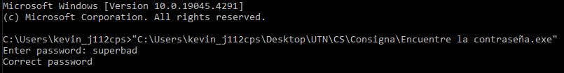

# Laboratorio 1 - Ciberseguridad

Trabajo realizado en la primera vivencia de laboratorio de la cursada de Ciberseguridad, UTN FRBA 1er Cuatrimestre 2024.

**Curso**: K3011

**Profesores**: Gabriela Verónica Nicolao - Paula Alicia Suarez - Matias Mikael Baghdassarian

**Alumno**: Kevin Harold Quiñones Garnica

**Legajo**: 173.110-5

Este documento tiene como finalidad explicar, detallar y mostrar los conocimientos adquiridos a lo largo del laboratorio a través de un *walk through* de los tres ejercicios realizados, y como detalle final, resolver dos ejercicios del sitio web [*ringzer0*](https://ringzer0ctf.com/), adjuntando la resolución junto con sus debidas *flags*.

**Programas utilizados**

- PEstudio
- dnSPY
- HxD
- Ida free

## Índice

- [Laboratorio 1 - Ciberseguridad](#laboratorio-1---ciberseguridad)
  - [Índice](#índice)
    - [Primera parte](#primera-parte)
      - [Crackme.exe](#crackmeexe)
        - [Consigna](#consigna)
        - [Resolución](#resolución)
        - [Keygen](#keygen)
      - [Encuentre la contraseña.exe](#encuentre-la-contraseñaexe)
        - [Consigna](#consigna-1)
        - [Resolución](#resolución-1)
        - [Parchear para que cualquier contraseña valga](#parchear-para-que-cualquier-contraseña-valga)
      - [RemoveCheck.exe](#removecheckexe)
        - [Consigna](#consigna-2)
        - [Resolución](#resolución-2)
    - [Segunda parte](#segunda-parte)
      - [Ejercicio 18](#ejercicio-18)
      - [Ejercicio 71](#ejercicio-71)

### Primera parte

#### Crackme.exe

##### Consigna

- Este es un programa codificado en C# (.NET) usando Visual Studio 2010.
- El ID de usuario debe ser un integer menor a 4 digitos.
- El código de usuario también debe ser un integer.

1. Estudie la lógica del programa para encontrar la solución.
2. Programe un [keygen](#keygen).

##### Resolución

Nos dieron un archivo ejecutable que debemos analizar para cumplir con las consignas, obedeciendo las condiciones a cumplir. Como primer medida de seguridad, más que nada para adoptar buenas prácticas, abrimos una maquina virtual corriendo Windows 10 como SO donde tenemos los programas a utilizar.

Como primer paso, que se repetirá a lo largo del laboratorio, abrimos el ejecutable dentro del PEstudio, que es una herramienta de análisis estático que nos permite obtener las principales características del ejecutable a analizar sin la necesidad de que ejecute. Como datos importantes a ver en el PEstudio son los *first bytes*, el *tamaño*, la *entropía*, metadata, los hashes *md5* y *sha256*, el *compiler stamp*, *signature*, para que tipo de cpu está diseñado (32-bit o 64-bit), *strings*, etc.

**Datos relevantes**

|Descriptor|Data|
|-|-|
|first-bytes-hex|4D 5A 90 00 03 00 00 00 04 00 00 00 FF FF 00 00 B8 00 00 00 00 00 00 00 40 00 00 00 00 00 00 00 00|
|first-bytes-text| M Z .. .. .. .. .. .. .. .. .. .. .. .. .. .. .. .. .. .. .. .. .. .. @ .. .. .. .. .. .. .. .. |
|size|5632 bytes|
|entropy| 4.185|
|signature| Microsoft .NET|
|cpu| 32-bit|
|compiler-stamp| Tue Feb 15 17:56:03 2011 UTC|
|virustotal-score|(2/71)|

Muchos de estos datos, por más que en general te indiquen una situación, dependerá de nuestro analisis el tomar la decisión de si hacer caso a los casos generales. Como ejemplo tenemos el dato de *virustotal-score* que nos dice que dos analizadores lo catalogaron como malware dentro de 71 posibles, pero al ser un número bajo, podemos inferir que estamos ante un caso de *falso-positivo*, teniendo en consideración la fecha de compilación (que no necesariamente es la correcta), cuales fueron los analizadores que lo catalogaron como malware, si son de renombre o son genéricas, etc.

Una vez realizado una visualización genérica del programa, revisaremos los strings del mismo para tratar de ver si el archivo está *ofuscado*, ya que si tenemos pocos strings en un programa con un peso relativamente alto, nos puede dar esa señal de alarma. Además, como un string es una secuencia de caracteres seguidos del carácter nulo, PEstudio nos puede mostrar strings que sean imprimibles y tenga sentido, o una secuencia de caracteres sin sentido, que si son los que predominan, podriamos estar frente a un programa ofuscado.

Si juntamos la información que nos brindan los strings junto con la entropía del programa, en caso de que esta última sea alta (6 < entropía < 8), podemos inferir que esté ofuscado o parcialmente ofuscado.

¿Porque es importante ver los strings?

Porque nos muestra un pantallazo de lo que realiza el programa, ya que si hay urls, IP, dominio, etc a las que quiere acceder, lo va a mostrar. Las cadenas son importantes porque nos muestran comportamiento y datos relevantes que nos servirán para analizar y ver si hay comportamiento extraño.

Una vez hecho todo esto, abrimos el programa con el *dnSPY* ya que, al ser un programa progrado en .NET, podemos decompilarlo y ver a simple vista como está desarrollado.

Ahora podemos ver el comportamiento. Como primera acción, genera un `Keygen` cuya lógica es:

    private Keygen()
    {
        do
        {
            Console.Write("\nEnter User ID: ");
            this.UserID = Convert.ToInt32(Console.ReadLine());
            if (this.UserID > 0 && this.UserID < 10000)
            {
                this.UFlag = 1;
            }
            else
            {
                this.UFlag = 0;
                Console.WriteLine("\nUser ID Is Out Of Range! Please Enter Number Less Than 4 Digits...");
            }
        }
        while (this.UFlag == 0);
        Console.Write("\nEnter Code: ");
        this.UserCode = Convert.ToInt32(Console.ReadLine());
    }

Pide por consola que escriban un `User ID`, cuyo valor no puede sobrepasar los 4 dígitos. En caso de que suceda, se pide que reingrese un valor correcto. Este se guarda en la variable `this.UserID`.

Después, pasamos a la función `Generate()` que se encarga de generar el código correcto.

    private void Generate()
    {
        int num = this.UserID * 786;
        this.ValidCode = num * 17;
        num = this.ValidCode / 12;
        this.ValidCode = num + 1991;
    }

Como vemos, al `User ID` que ingresamos por consola, lo multiplica por 786 y por 17, para después dividirlo por 12 y al final sumarle 1991. Al valor obtenido lo almacena en `this.ValidCode`.

Ya teniendo `this.UserID` y `this.ValidCode`, se utiliza la función `Check()` que los comparará. Si son iguales, setteara su `RFlag` en 1. Caso contrario, lo setteara en 0.

Una vez conocidos estos valores, pasamos a ver el comportamiento de la función `main`

    private static void Main(string[] args)
    {
        Console.WriteLine("Crackme By HonestGamer");
        int num = 0;
        char c;
        do
        {
            Keygen keygen = new Keygen();
            keygen.Generate();
            keygen.Check(ref num);
            if (num == 0)
            {
                Console.Write("\nInvalid Code, Try Again (Y/N)? ");
                c = Convert.ToChar(Console.ReadLine());
            }
            else
            {
                c = 'N';
                Console.WriteLine("\nValid Code, Well Done! Write A Keygen Now...");
            }
        }
        while (c == 'Y' || c == 'y');
        Console.WriteLine("\nHit The Enter Key To End...");
        Console.ReadLine();
    }

Una vez realizada la comparación de los dos valores, si el `RFlag` es 1, habrás logrado poner un código correcto y para finalizar te pedira que apretes la tecla enter. En caso contrario, te dará la opción de intentar de nuevo en caso de que lo quieras hacer.

Ya leyendo esto, podemos lograr obtener siempre el resultado correcto. Abrimos el ejecutable y probamos con el `User ID` en 1 y 2.

##### Keygen

#### Encuentre la contraseña.exe

##### Consigna

1. Revise el código e indique cuál es la contraseña.
2. *Avanzado*: Parchar el código para que tome cualquier contraseña como correcta.

##### Resolución

Ya teniendo la experiencia del primer ejercicio, podemos no ser reiterativos en la explicación del uso de los programas y vamos a las partes esenciales de nuestro analisis. En este caso tenemos un ejecutable que primero analizaremos en el PEstudio para intentar resolver el primer punto que es indicar la contraseña.

**Datos relevantes**

|Descriptor|Data|
|-|-|
|first-bytes-hex|4D 5A 90 00 03 00 00 00 04 00 00 00 FF FF 00 00 B8 00 00 00 00 00 00 00 40 00 00 00 00 00 00 00 00|
|first-bytes-text| M Z .. .. .. .. .. .. .. .. .. .. .. .. .. .. .. .. .. .. .. .. .. .. @ .. .. .. .. .. .. .. .. |
|size|40960 bytes|
|entropy| 4.928|
|signature| Microsoft Visual C++ 7.0|
|cpu| 32-bit|
|compiler-stamp| Wed Sep 15 03:45:40 2010 UTC|
|virustotal-score|(0/71)|

Ahora, pasamos a la parte de strings para ver si este archivo está ofuscado y ver más datos relevantes. Podemos ver esto que nos da el indicio de que en algún momento de la ejecución del programa, nos va a pedir la contraseña y se hará una verificación de si es correcta o no.

Como el programa no tiene de firma Microsoft .NET, no podemos utilizar el dnSPY, pero para ello podemos utilizar IDA free, pero este tiene una diferencia con el dnSPY y es que IDA free es un desensamblador, mientras que el dnSPY es un decompilador.

Abrimos en el IDA free el ejecutable y nos muestra en lenguaje assembler la lógica. Probamos ejecutando el programa y testeando el comportamiento. Después de una finita cantidad de intentos fallidos, el programa cierra, por lo que nos da indicio de que en vez de un while que te permita reintentar infinitas veces, hay un for que tiene limitado la cantidad de intentos.

Acá podemos ver que se inicializa una variable en 0, y luego esta se compara con el valor 64h en hexadecimal, que sería el 100 en decimal. Lo que nos muestra es un for que repetirá la lógica de ingreso de la contraseña 100 veces ante el caso fallido, y si llega a 100, cierra el programa.

Lo podemos ver ya que hace un `jge loc_4010C9`, que cuando la variable sea mayor a 100, salte para acá.

Pero bueno, lo que nos interesa es la lógica para descubrir la contraseña.

Sin entrar en detalles de assembler, se hace un `call` a la función `printf` que muestra por pantalla el mensaje *"Enter Password: "*

    add     esp, 0Ch
    push    offset Format   ; "Enter password: "
    call    _printf

Cuyo valor ingresado lo guarda con `fgets`. Vemos que lo ingresado se almacena en la variable `Str1`, lo pushea a la pila y llama a `strlen`

    add     esp, 4
    push    offset Stream   ; Stream
    push    100h            ; MaxCount
    lea     edx, [ebp+Str1]
    push    edx             ; Buffer
    call    _fgets
    add     esp, 0Ch
    lea     eax, [ebp+Str1]
    push    eax             ; Str
    call    _strlen

Y al final realiza una comparación con `strcmp` para ver si la contraseña ingresada es la correcta. Para hacerlo, pushea a la pila el valor de `Str1` junto a un valor `Str2`, al cual el IDA nos muestra que tiene por valor *"superbad"* probablemente porque esté hardcodeado.

    add     esp, 4
    mov     byte ptr [ebp+eax+var_10C+3], 0
    mov     ecx, Str2
    push    ecx             ; Str2
    lea     edx, [ebp+Str1]
    push    edx             ; Str1
    call    _strcmp

Para finalizar, realiza un `jz short loc_4010B5` que es la verificación del valor de retorno de `strcmp`. Si es 0, es porque son strings idénticos y muestra por pantalla el mensaje de *"Correct password"* para finalizar el programa. Si no es 0, vuelve por el for mostrando por pantalla *"Wrong password"* y volviendo a comenzar.

Una vez encontrado el valor de la contraseña, corroboramos y vemos que efectivamente era la correcta.

##### Parchear para que cualquier contraseña valga

El segundo punto de este ejercicio es lograr parchear el programa para que, independientemente del valor que pongas, logre aceptar la contraseña.

El truco para lograr esto está en la parte final del bloque que evalua los dos strings. Podemos ver que realizaba un salto condicional a `loc_4010B5si` si el valor era 0 después de comparar los strings, donde está el bloque que dice *"Correct password"* y finaliza el programa. Como lo que nos interesa es que cualquier contraseña valga, debemos hacer que en vez de realizar un salto condicional, haga un `jmp` hacia `loc_4010B5si`.

Para lograrlo, vemos que en la tabla hexadecimal, el `jz` está representado por 74 0F, donde **74** es el valor de la operación salto condicional y **0F** es el valor restante a la que saltará `jz`. Y `jmp`, tiene como opcode el valor **EB** hexadecimal.

Entonces, con cambiar el 74 a EB, lograríamos cambiar de operación, pasando de salto condicional a un salto normal. Para ello, usaremos un editor hexadecimal como lo es HxD.

Con el IDA copiamos la secuencia de números hexadecimales donde está lo que queremos cambiar, para buscarlo con el HxD que tiene abierto para editar el ejecutable. Una vez encontrado esa secuencia, cambiamos el 74 por EB y listo.

Probamos el nuevo ejecutable parcheado.

Y lo revisamos en el IDA para ver que efectivamente cambio de opcode.

#### RemoveCheck.exe

##### Consigna

1. Modifique el programa para que cualquier nombre de organizacion y serial ingresados sean validos.

##### Resolución

Para resolver este ejercicio, primero analicemos el ejecutable para entender con que estamos lidiando.

**Datos relevantes**

|Descriptor|Data|
|-|-|
|first-bytes-hex|4D 5A 90 00 03 00 00 00 04 00 00 00 FF FF 00 00 B8 00 00 00 00 00 00 00 40 00 00 00 00 00 00 00 00|
|first-bytes-text| M Z .. .. .. .. .. .. .. .. .. .. .. .. .. .. .. .. .. .. .. .. .. .. @ .. .. .. .. .. .. .. .. |
|size|6144 bytes|
|entropy| 4.950|
|signature| Microsoft Visual C++|
|cpu| 32-bit|
|compiler-stamp| Sun Nov 04 20:48:40 2007 UTC|
|virustotal-score|(0/71)|

Y acá están estos strings que muestran un poco el comportamiento

Abrimos el ejecutable en IDA free

El comportamiento es el siguiente. Muestra por pantalla el mensaje *"Enter organization name: "* y almacena el valor ingresado con `scanf`. Repetimos lo mismo con *"Enter serial number: "*. Los datos ingresados sobre la organización se guardan en eax y el serial en edx.

Una vez realizado, llama a `sub_401740` que es un bloque aparte que realiza lo siguiente

Basicamente lo que hace, es una llamada a dos `strlen`, donde guardan los datos ingresados de la organización al registro `eax` y después guardarlo en `[ebp+var_4]` y en `[ebp+var_8]`. Al final se realiza un `cmp` entre `edx` y `[ebp+var_8]`. Con el resultado, pasamos a `jnz short loc_401775` donde si el `cmp` pone el `ZF` en 1 por ser dos cosas iguales que se compararon, pone en 0 el registro `eax` con `xor` y retorna. Si por el contrario no salta, pone el `eax` en 1 y retorna.

Después de ejecutar ese bloque, el valor de `eax` se guarda en `[ebp+var_4]` y hace el `cmp` de ese valor con 0. Sigue con un `jz short loc_401856`. Si el valor retornado por `sub_401740` fue 0, da error con el mensaje *"An invalid serial number was entered"* y vuelve a comenzar todo. En el otro caso, sale el mensaje *"A valid serial number was entered"* y cierra.

Como el ejercicio pide que cualquier nombre de organización y serial sea válido, aplicaremos una solución parecida al ejercicio dos, donde modificaremos el valor hexadecimal del `jz short loc_401856` por `js short loc_401856`, donde `js` que es "Jump if sign", va a saltar al bloque donde tira el error y volvemos a comenzar si el flag `SF` está en 1, pero como el `cmp` previo te da o 0 o 1 ya que en teoría realiza un `sub`, nunca se va a alterar el `SF`, asi que siempre va a pasar por el bloque de verdadero.

Acá vemos los resultados

### Segunda parte

#### Ejercicio 18

**Look inside the house**

Flag encontrada: **FLAG-5jk682aqoepoi582r940oow**

Tenemos como inicio un boton para descargar un .zip que contiene una imagen, que es de una casa. Como es un ejercicio de esteganografia, primero traté de analizar la imagen a simple vista como en el ejercicio hecho en clase de una imagen con un mapa, para ver si había algún dato que me diera una pista o la solución, pero no la encontré.

Como realicé la prueba en una máquina virtual de Kali Linux (Siendo esta, mi primera vez manejando esta distribución de Linux), traté de aprender sobre programas que me ayuden con la esteganografía. Encontré sobre steghide para leer la metadata de la imagen ya que el título del ejercicio hace referencia a que hay algo adentro.

Ejecuté el comando `steghide info 3e634b3b5d0658c903fc8d42b033fa57.jpg` y obtuve.

Como nos habían dicho, la flag comienza con la palabra flag, así que probé "flag.txt" y falló. Así que viendo mejor, vi que ese archivo estaba embebido dentro de la imagen, así que leyendo un poco sobre la [documentación](https://www.kali.org/tools/steghide/) de steghide, vi que podía ejecutar este comando `steghide extract -sf 3e634b3b5d0658c903fc8d42b033fa57.jpg` y extrajo el .txt

Y en el flag..txt estaba la clave

#### Ejercicio 71

**Victor reloaded**

Flag encontrada: **flagarenice**

    Viens ! - une phlûte invisibe
    Soupire dens les verjers. -
    La chenson la plus paisible
    Est la chanson des bergeés.

    Le vant ride, sous l'yeuse,
    Le sombre miroir des eaux. -
    La chamson la plus joyeuse
    Est la chanson des oyseaux.

    Que nul soin ne te tourmente.
    Aimons-nous! aimons toujours ! -
    La shanson la plus charmante
    Est la chanson dais amours. 

Volvemos a tener un texto que parece un poema o algo parecido a lo que fue el ejercicio 70 realizado en el laboratorio. Como el nombre lo indica, parece que volvemos a toparnos con Victor Hugo, así que busco en Google el fragmento.

Me encuentro con [esto](https://www.bachlund.org/Viens.htm).

    Viens ! - une flûte invisible - (2015)
    Victor Hugo
    for soprano and piano

    Viens ! - une flûte invisible
    Soupire dans les vergers. -
    La chanson la plus paisible
    Est la chanson des bergers.

    Le vent ride, sous l'yeuse,
    Le sombre miroir des eaux. -
    La chanson la plus joyeuse
    Est la chanson des oiseaux.

    Que nul soin ne te tourmente.
    Aimons-nous! aimons toujours ! -
    La chanson la plus charmante
    Est la chanson des amours.

A simple vista, parecen iguales pero no lo son, vemos que hay palabras cambiadas. Por ejemplo, en la letra original dice *Viens ! - une flûte invisible* pero en el texto que nos dieron al comienzo dice *Viens ! - une **ph**lûte invisi**be***, y así en todo el texto. Si usamos un software que compare letra por letra las diferencias, obtenemos esto.

En el cual, si juntamos todas las letras cambiadas en el texto original, nos queda este mensaje: **flagarenice**, el cual, como comienza con "flag", lo probamos y obtenemos dos puntos.
